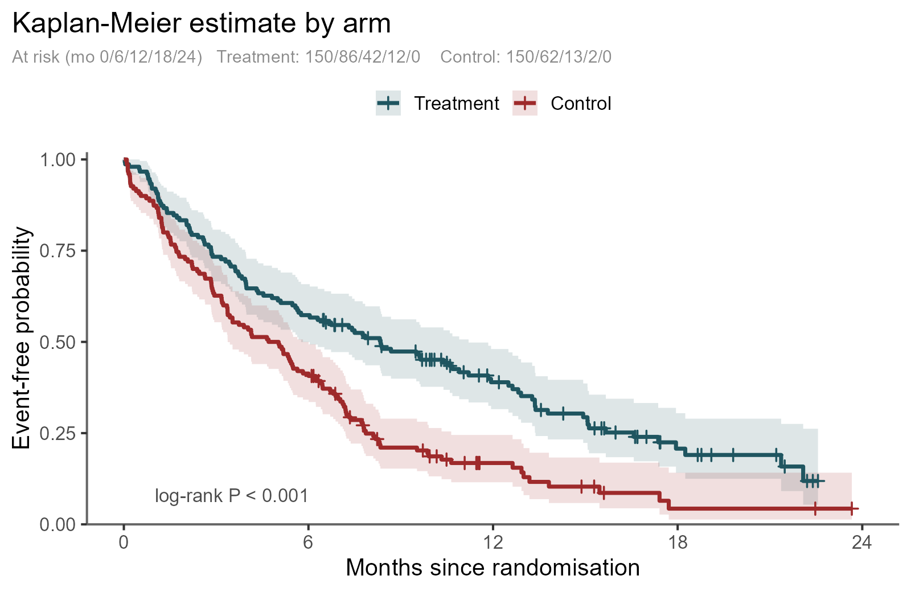
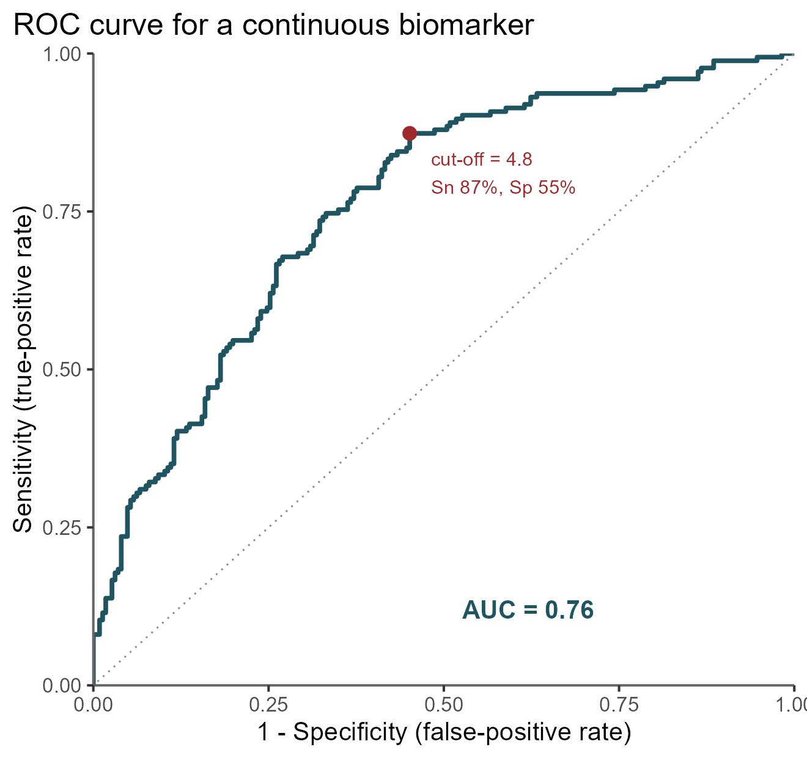
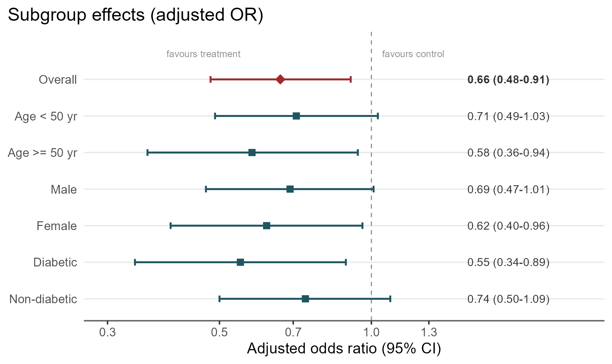

## Contents

::: {.incremental}
-   The Methods–Results **mirror**
-   Where data live: **text vs table vs figure**
-   Reporting a result **fully**
-   Tables & figures **by design**
-   Activities · Checklist
:::


# *"Methods was the recipe. <br>Results is the dish."*

## Yesterday's recipe, today's dish

```{mermaid}
%%| fig-width: 10
%%| fig-height: 2
%%| fig-responsive: true
flowchart LR
  I[Introduction] --> M[Methods] --> R[Results] --> D[Discussion]
```

-   **M** — *what you did* ← Day 1
-   **R** — *what you found* ← **this session**

. . .

::: {.callout-tip appearance="important"}
Results is where we either **over-cook** (data dump) or **under-plate** (interpretation).
:::

## Results must mirror Methods

::::: columns
::: {.column width="50%"}
**Methods**

1.  Study design
2.  Variables & measurements
3.  Primary analysis
4.  Subgroups / sensitivity
:::

::: {.column width="50%"}
**Results**

1.  → Participant flow
2.  → Table 1
3.  → Primary outcome
4.  → Subgroups / sensitivity
:::
:::::

. . .

::: {.callout-note appearance="simple"}
Lay the two sections side by side — they should **reflect**. Anything in Results not set up in Methods is a red flag.
:::

:::{.aside}
Kotz & Cals, J Clin Epidemiol 2013; Enago Academy.
:::

## Steps

::: {.callout-note appearance="simple"}
### 

:::{.incremental}
1.  **Structure** Results to mirror Methods
2.  **Decide** whether as text vs table vs figure
3.  **Report** stats fully: effect + CI + exact *P*
4.  **Match** figure type to study design

:::
:::

. . .

- Step **3** is the commonest reviewer complaint on Indian submissions
- Step **4** separates a generic paper from an intentionally designed one.


## Structuring Results

. . . 

The first Results paragraph is always participant flow

. . . 

::::: columns
::: {.column width="65%"}

<br>

-   Paragraph 1 = **who is in the analysis**
-   Screened → Eligible → Enrolled → Analysed
-   Account for **every** participant
-   Losses & exclusions, **with reasons**
:::

::: {.column width="35%"}
```{mermaid}
%%| fig-width: 4
%%| fig-height: 4
flowchart TD
  S[Screened] --> E[Eligible]
  E --> EN[Enrolled]
  EN --> AN[Analysed]
  E -. excluded .-> X1[ ]
  EN -. lost .-> X2[ ]
```
:::
:::::


:::{.aside}
CONSORT 2010 Item 13a · STROBE Item 13 · STARD 2015 Item 19.
:::

## State Every Finding Only Once

::::: columns
::: {.column width="33%"}
::: {.callout-note appearance="simple"}
### TEXT
headlines, ≤ 3 numbers
:::
:::

::: {.column width="33%"}
::: {.callout-note appearance="simple"}
### TABLE
many exact numbers
:::
:::

::: {.column width="33%"}
::: {.callout-note appearance="simple"}
### FIGURE
patterns, trends, time
:::
:::
:::::

. . .

Then **cross-reference** — never repeat. *"Anaemia was the commonest morbidity (Table 2)."*

::: {.important}
The same numbers in a sentence, a table, **and** a chart inflates length and signals inexperience.
:::

:::{.aside}
ICMJE Recommendations; AMA Manual of Style 
:::

## Decision Time?

:::{.incremental}
- Read precisely [→ table]{.fragment} 
- See instantly [→ figure]{.fragment} 
- Headline [→ text]{.fragment}
:::


## Where to place??


| Data scenario | Where |
|:---|:---|
| One key number (a single prevalence / effect) | **Text** |
| Baseline characteristics, many variables × groups | **Table** |
| Participant flow (screened → analysed) | **Figure**|
| Spread of a continuous variable | **Figure** |
| Many exact estimates readers may re-use | **Table** |


## A complete result has direction, magnitude, precision, and exact *P*

<br>

> **RR 0.66 (95% CI 0.48–0.91); *P* = 0.01**

::::: columns

:::{.fragment}
::: {.column width="50%"}
-   **Direction** - which way 
-   **Magnitude** - how much 
:::
:::

:::{.fragment}
::: {.column width="50%"}
-   **Precision** - the 95% CI 
-   *P value* - 0.01, not "< 0.05" 
:::
:::
:::::

. . .

::: {.important}
*P* is the **adjunct**; the CI is the message.

Never *"P = 0.000"* → report **P < 0.001**
:::


## Three sentences a reviewer will flag

::: panel-tabset
### Data dump

"The mean age was 42.3 years, 58% male, 31% smokers, 22% diabetic, 40% hypertensive, 18% CKD, BMI 26.4, HbA1c 7.8%…"*

::: {.fragment}

$$ \downarrow $$ 

"Participants had a mean age of 42 years and were predominantly male (58%); cardiometabolic comorbidity was common (Table 1)."
:::

### Interpretation creep

"Mortality was higher in the control arm **because** dexamethasone suppresses the harmful inflammatory cascade."

::: {.fragment}


$$ \downarrow $$ 


"28-day mortality was lower in the dexamethasone arm (22.9% vs 25.7%)." 

Mechanism is **Discussion**.
:::

### Naked *p*-value

"The intervention significantly reduced infection (p < 0.05)."

::: {.fragment}


$$ \downarrow $$ 

"…reduced surgical-site infection by 6.2 points (12.1% vs 18.3%; RR 0.66, 95% CI 0.48–0.91; *P* = 0.01)."
:::
:::


## ⚡  Question Time

:::{.incremental}
1.  A single overall prevalence
2.  Baseline characteristics, 12 variables × 2 groups
3.  Survival over 24 months by arm
4.  Participant flow
5.  Distribution of CRP in 30 patients
6.  Three subgroup odds ratios *(deliberately ambiguous)*

:::


## Answers

| # | Scenario | Decision |
|:--|:---|:---|
| 1 | Single prevalence | **Text** |
| 2 | Baseline characteristics | **Table** |
| 3 | Survival by arm | **Figure**|
| 4 | Participant flow | **Figure** |
| 5 | CRP in 30 patients | **Figure** |
| 6 | Three subgroup ORs | **Table *or* forest plot** |


## Tables


::::: columns
::: {.column width="50%"}
-   Continuous, symmetric → **mean ± SD**
-   Continuous, skewed → **median (IQR)**
-   Categorical → **n (%)** with denominator
-   Title **above** · footnotes **below**
-   Abbreviations defined · **no vertical rules**
:::

::: {.column width="50%"}
| Characteristic | Arm A (n=105) | Arm B (n=108) |
|:---|:--:|:--:|
| Age, yr : mean ± SD | 54 ± 11 | 55 ± 10 |
| LOS, d : median (IQR) | 8 (5–12) | 9 (6–13) |
| Diabetes : n (%) | 31 (29.5) | 29 (26.9) |
:::
:::::

::: {.callout-note appearance="simple"}
Don't put **mean ± SD** on length-of-stay.  It is always right-skewed.
:::


## *P*-values in Table 1 

::: panel-tabset
### RCT

-   **NO** baseline *p*-values
-   Randomisation handles balance by design
-   Any baseline difference **is** a chance difference; testing it answers a question no one asked
-   *CONSORT discourages it*

### Observational

-   Groups **self-select** → show comparability
-   Use a **standardised mean difference (SMD)** or a group comparison
-   Interpret as **balance**, not hypothesis-testing
:::

::: {.important}
The single most common Table 1 error in resident **RCT** manuscripts.
:::


## Match the figure type to the study design =

| Design | Key figures |
|:---|:---|
| **All** | Participant flow diagram |
| Cross-sectional | Ordered bar · prevalence map · forest (aOR) |
| Case-control | Forest (OR) · exposure distribution |
| Cohort | K–M · incidence · forest (subgroups) |
| Diagnostic | STARD flow · ROC · dot plot by status |
| RCT | CONSORT flow · K–M · forest · NNT |
| Syst. review | PRISMA flow · forest · funnel |


## Maximise data-ink ratio

::::: columns
::: {.column width="50%"}
**Remove**

-   3-D, exploding slices
-   gridlines, heavy borders
-   redundant legends
:::

::: {.column width="50%"}
**Keep**

-   the data
-   direct labels
-   the **one** key finding
:::
:::::


## Generate your figures to be reproducible by design

::: panel-tabset
### Kaplan–Meier

{fig-align="center" width="78%"}

### ROC

{fig-align="center" width="46%"}

### Forest

{fig-align="center" width="80%"}
:::


## Observational Results: prevalence, odds, person-time 

::: panel-tabset
### Cross-sectional

-   **Prevalence + 95% CI**; adjusted ORs (aOR)
-   **Weights / design effect** if clustered (NFHS-style)
-   Say *"associated with"* ; **never** *"caused"*

### Case-control

-   **Odds ratios**, not risk ratios
-   Matched design → **conditional logistic** (matched OR)
-   Report exposure distribution by case/control

### Cohort

-   **Person-time**, incidence rates
-   **Follow-up completeness & attrition** before the HR
-   HR + CI · K-M · acknowledge **competing risks**
:::


## Diagnostic Results: the 2×2, accuracy with CIs, and the ROC 

::::: columns
::: {.column width="48%"}
|  | Disease + | Disease − |
|:--|:--:|:--:|
| **Test +** | TP | FP |
| **Test −** | FN | TN |
:::

::: {.column width="52%"}
-   Sens, Spec, PPV, NPV, LR± ; **all with 95% CI**
-   **ROC + AUC** ; the sens/spec trade-off
-   Report **indeterminate / failed** tests
-   **STARD flow** accounts for everyone
:::
:::::

::: {.important}
Give the 2×2 explicitly so the reader can recompute anything. Accuracy varies with disease spectrum — report across it.
:::


## Take Home Message


> Report what you found: **direction, magnitude, precision** and let the Discussion do the rest.


> Text vs Table vs Figure


# Questions?

# Thank You! 
